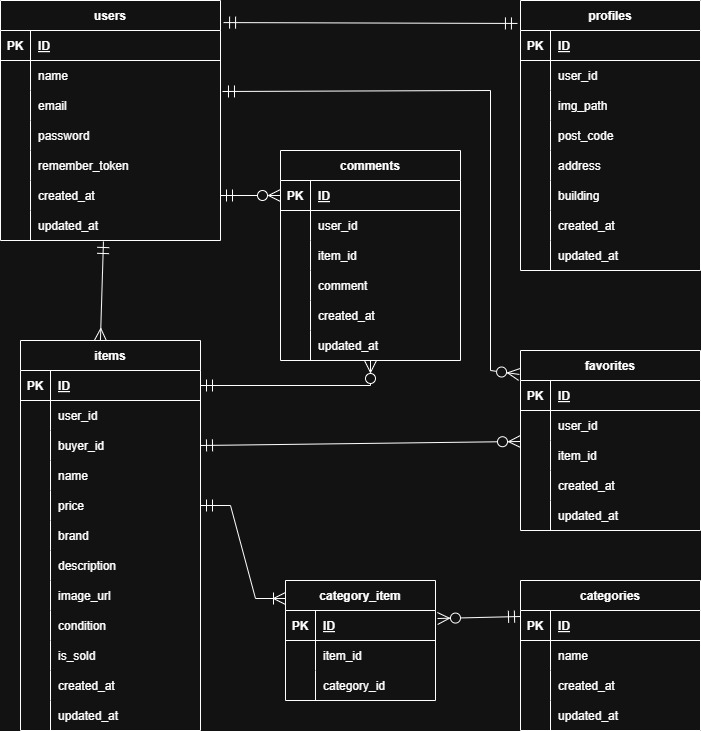

# coachtechフリマ

ユーザー間で手軽に商品の売買ができる、プラットフォームです。

本プロジェクトはDockerコンテナ上で動作します。

## 環境構築

```bash
git clone https://github.com/orangecraftsparkling-3280/fleamarket-sample.git
cd confirmation-test
docker compose up -d --build
cp src/.env.example src/.env
docker compose exec php composer install
docker compose exec php php artisan key:generate
```

## .envファイル設定

```bash
DB_CONNECTION=mysql
DB_HOST=mysql
DB_PORT=3306
DB_DATABASE=laravel_db
DB_USERNAME=laravel_user
DB_PASSWORD=laravel_pass
```

# .envファイル設定後実行

```bash
docker compose exec php php artisan migrate --seed
```

## 実行環境

### Docker環境

Docker 20.x 以上
Docker Compose 1.29.x 以上
PHP 8.x
Laravel 10.x
MySQL 8.0.26
Nginx 1.21.1

### ホストOS

macOS / Windows / Linux（Dockerが動作する環境）

### 推奨ブラウザ

Chrome / Firefox / Edge（最新バージョン）

### 接続先一覧

Webサイト: http://localhost

DB管理: http://localhost:8080

メールテスト: http://localhost:8025

### データベース設計

<details>
<summary>テーブル仕様書を表示する</summary>

#### users（ユーザー）

| カラム名       | 型     | 制約             | 説明                         |
| :------------- | :----- | :--------------- | :--------------------------- |
| id             | bigint | Primary Key      | ユーザーの固有ID             |
| name           | string | Not Null         | ユーザー名                   |
| email          | string | Not Null, Unique | メールアドレス（ログイン用） |
| password       | string | Not Null         | パスワード（ハッシュ化）     |
| remember_token | string | Nullable         | ログイン保持用トークン       |

#### profiles（プロフィール）

| カラム名  | 型     | 制約        | 説明                     |
| :-------- | :----- | :---------- | :----------------------- |
| id        | bigint | Primary Key | プロフィールID           |
| user_id   | bigint | Foreign Key | users.id への外部参照    |
| img_path  | string | Nullable    | プロフィール画像へのパス |
| post_code | string | Not Null    | 郵便番号                 |
| address   | string | Not Null    | 住所                     |
| building  | string | Nullable    | 建物名                   |

#### items（商品）

| カラム名    | 型      | 制約                   | 説明               |
| :---------- | :------ | :--------------------- | :----------------- |
| id          | bigint  | Primary Key            | 商品ID             |
| user_id     | bigint  | Foreign Key            | 出品者のユーザーID |
| buyer_id    | bigint  | Foreign Key (Nullable) | 購入者のユーザーID |
| name        | string  | Not Null               | 商品名             |
| price       | int     | Not Null               | 販売価格           |
| brand       | string  | Nullable               | ブランド名         |
| description | text    | Not Null               | 商品の説明文       |
| image_url   | string  | Not Null               | 商品画像のURL      |
| condition   | string  | Not Null               | 商品の状態         |
| is_sold     | boolean | Default: false         | 販売済みフラグ     |

#### comments（コメント）

| カラム名 | 型     | 制約        | 説明             |
| :------- | :----- | :---------- | :--------------- |
| id       | bigint | Primary Key | コメントID       |
| user_id  | bigint | Foreign Key | コメント投稿者ID |
| item_id  | bigint | Foreign Key | 対象の商品ID     |
| comment  | text   | Not Null    | コメント本文     |

#### favorites（お気に入り）

| カラム名 | 型     | 制約        | 説明                 |
| :------- | :----- | :---------- | :------------------- |
| id       | bigint | Primary Key | お気に入りID         |
| user_id  | bigint | Foreign Key | いいねしたユーザーID |
| item_id  | bigint | Foreign Key | いいねされた商品ID   |

#### categories & 中間テーブル

| テーブル名    | カラム名    | 型     | 説明                         |
| :------------ | :---------- | :----- | :--------------------------- |
| categories    | name        | string | カテゴリー名                 |
| category_item | item_id     | bigint | itemsテーブルとの紐付け      |
| category_item | category_id | bigint | categoriesテーブルとの紐付け |

</details>

### ER図


