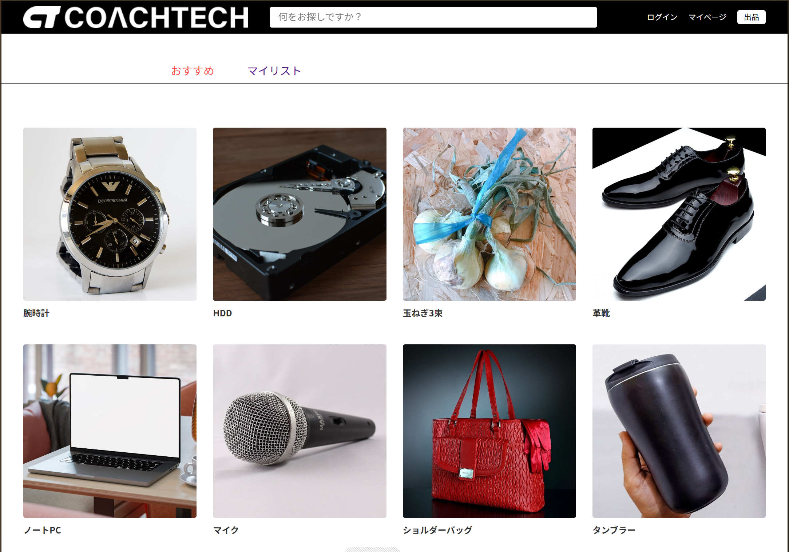
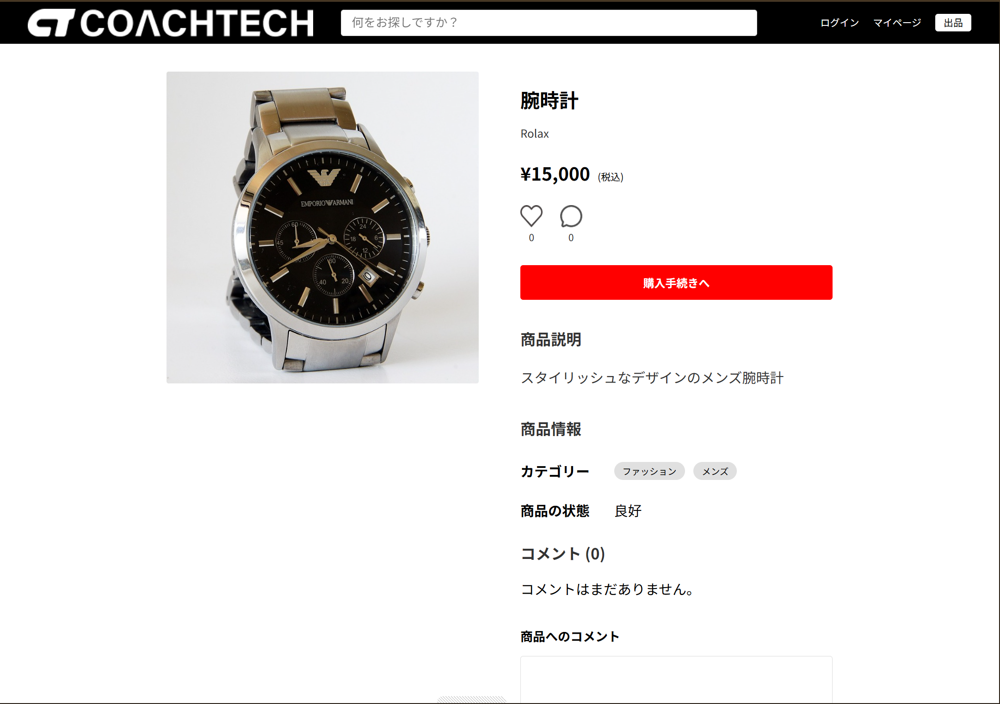
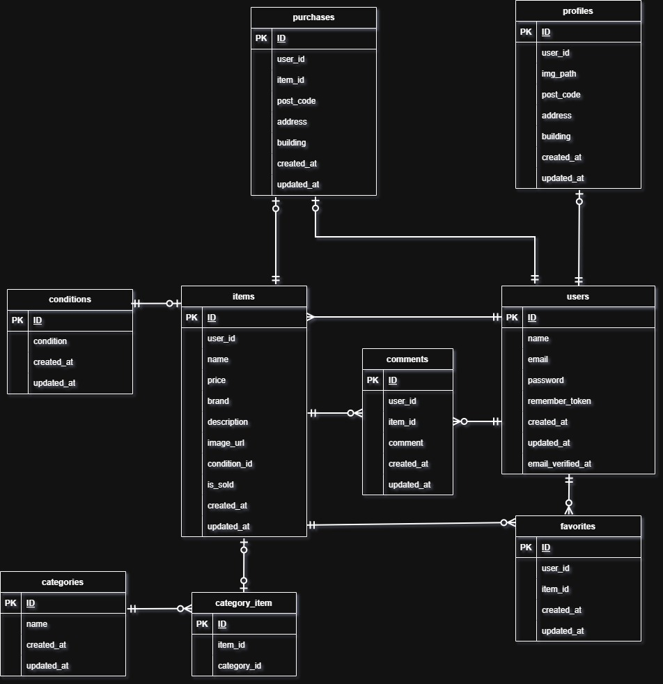

# coachtechフリマ


ユーザー間で手軽に商品の売買ができる、プラットフォームです。

## スクリーンショット

|                商品一覧画面                |                商品詳細画面                |
| :----------------------------------------: | :----------------------------------------: |
|  |  |

## 機能一覧

- ユーザー登録・プロフィール編集
- メール認証機能
- 商品出品・編集・削除
- 商品一覧表示（売却済み判定）
- 商品検索機能・カテゴリー絞り込み
- いいね機能・コメント投稿機能
- 決済機能（Stripe連携）

本プロジェクトはDockerコンテナ上で動作します。

## 環境構築

```bash
git clone https://github.com/orangecraftsparkling-3280/fleamarket-sample.git
cd fleamarket-sample
docker compose up -d --build
cp src/.env.example src/.env
docker compose exec php composer install
docker compose exec php php artisan key:generate
docker compose exec php php artisan storage:link
```
MySQLコンテナの起動完了までに時間がかかることがあります。
数秒待ってから下記のコマンドを実行してください。

```bash
docker compose exec php php artisan migrate --seed
docker compose exec php chmod -R 777 storage bootstrap/cache
```

# 💳 決済機能（Stripe）の設定
本プロジェクトで決済機能を利用するには、StripeのAPIキー設定が必要です。

1, APIキーの取得: [Stripeダッシュボード（APIキー）](https://dashboard.stripe.com/test/apikeys)からテスト用キーを取得します。

2, .envの編集: src/.env の末尾に取得したキーを追記します。

```bash
STRIPE_PUBLIC_KEY=pk_test_...（取得したキー）
STRIPE_SECRET_KEY=sk_test_...（取得したキー）
```

設定の反映: キーを記述した後、必ず以下のコマンドでキャッシュをクリアしてください。

```Bash
docker compose exec php php artisan config:clear
```

## 👤 テスト用ログインアカウント

環境構築後の動作確認用に、以下のユーザーでログイン可能です

| 項目               | 設定値             |
| :----------------- | :----------------- |
| **メールアドレス** | `user@example.com` |
| **パスワード**     | `password`         |

 ※ 商品を出品した状態を確認したい場合は、以下のユーザーをご利用ください。

| 項目               | 設定値             |
| :----------------- | :----------------- |
| **メールアドレス** | `sell@my.com` |
| **パスワード**     | `password`         |

## 実行環境

### Docker環境

Docker 20.x 以上
Docker Compose 1.29.x 以上
PHP 8.x
Laravel 10.x
MySQL 8.0.26
Nginx 1.21.1

### ホストOS

macOS / Windows / Linux（Dockerが動作する環境）

### 推奨ブラウザ

Chrome / Firefox / Edge（最新バージョン）

### 接続先一覧

Webサイト: http://localhost

DB管理: http://localhost:8080

メール承認テスト(MailHog): http://localhost:8025

・会員登録時のメール認証などがこのツールに届きます。

## 🛠 データベース設計

> 各テーブル名をクリックすると、詳細なカラム構成を確認できます。
> <br>

<details>
<summary> 📘 <code>users</code></summary>
<br>

| カラム名              | 型              | PK  | UK  | NN  | 備考 |
| :-------------------- | :-------------- | :-: | :-: | :-: | :--- |
| **id**                | unsigned bigint |  ○  |     |  ○  |      |
| **name**              | string          |     |     |  ○  |      |
| **email**             | string          |     |  ○  |  ○  |      |
| **password**          | string          |     |     |  ○  |      |
| **remember_token**    | varchar(100)    |     |     |     |      |
| **email_verified_at** | timestamp       |     |     |     |      |

</details>

<details>
<summary> 📗 <code>items</code></summary>
<br>

| カラム名         | 型              | PK  | UK  | NN  | FK (参照先)      |
| :--------------- | :-------------- | :-: | :-: | :-: | :--------------- |
| **id**           | unsigned bigint |  ○  |     |  ○  |                  |
| **user_id**      | unsigned bigint |     |     |  ○  | `users(id)`      |
| **name**         | string          |     |     |  ○  |                  |
| **price**        | integer         |     |     |  ○  |                  |
| **brand**        | string          |     |     |     |                  |
| **description**  | text            |     |     |  ○  |                  |
| **image_url**    | string          |     |     |  ○  |                  |
| **condition_id** | unsigned bigint |     |     |  ○  | `conditions(id)` |
| **is_sold**      | boolean         |     |     |  ○  |                  |

</details>

<details>
<summary> 📕 <code>purchases</code></summary>
<br>

| カラム名      | 型              | PK  | UK  | NN  | FK (参照先) |
| :------------ | :-------------- | :-: | :-: | :-: | :---------- |
| **id**        | unsigned bigint |  ○  |     |  ○  |             |
| **user_id**   | unsigned bigint |     |     |  ○  | `users(id)` |
| **item_id**   | unsigned bigint |     |  ○  |  ○  | `items(id)` |
| **post_code** | string(8)       |     |     |  ○  |             |
| **address**   | string          |     |     |  ○  |             |
| **building**  | string          |     |     |     |             |

</details>

<details>
<summary> 📙 <code>profiles</code></summary>
<br>

| カラム名      | 型              | PK  | UK  | NN  | FK (参照先) |
| :------------ | :-------------- | :-: | :-: | :-: | :---------- |
| **id**        | unsigned bigint |  ○  |     |  ○  |             |
| **user_id**   | unsigned bigint |     |  ○  |  ○  | `users(id)` |
| **img_path**  | string          |     |     |     |             |
| **post_code** | string(8)       |     |     |     |             |
| **address**   | string          |     |     |     |             |
| **building**  | string          |     |     |     |             |

</details>

<details>
<summary> 📒 <code>favorites</code></summary>
<br>

| カラム名    | 型              | PK  | UK  | NN  | FK (参照先) |
| :---------- | :-------------- | :-: | :-: | :-: | :---------- |
| **id**      | unsigned bigint |  ○  |     |  ○  |             |
| **user_id** | unsigned bigint |     |  ○  |  ○  | `users(id)` |
| **item_id** | unsigned bigint |     |  ○  |  ○  | `items(id)` |

</details>

<details>
<summary> 📔 <code>categories</code></summary>
<br>

| カラム名 | 型              | PK  | UK  | NN  | 備考 |
| :------- | :-------------- | :-: | :-: | :-: | :--- |
| **id**   | unsigned bigint |  ○  |     |  ○  |      |
| **name** | string          |     |     |  ○  |      |

</details>

<details>
<summary> 📑 <code>category_item</code></summary>
<br>

| カラム名        | 型              | PK  | UK  | NN  | FK (参照先)      |
| :-------------- | :-------------- | :-: | :-: | :-: | :--------------- |
| **id**          | unsigned bigint |  ○  |     |  ○  |                  |
| **item_id**     | unsigned bigint |     |     |  ○  | `items(id)`      |
| **category_id** | unsigned bigint |     |     |  ○  | `categories(id)` |

</details>

<details>
<summary> 💬 <code>comments</code></summary>
<br>

| カラム名    | 型              | PK  | UK  | NN  | FK (参照先) |
| :---------- | :-------------- | :-: | :-: | :-: | :---------- |
| **id**      | unsigned bigint |  ○  |     |  ○  |             |
| **user_id** | unsigned bigint |     |     |  ○  | `users(id)` |
| **item_id** | unsigned bigint |     |     |  ○  | `items(id)` |
| **comment** | text            |     |     |  ○  |             |

</details>

<details>
<summary> ⚙️ <code>conditions</code></summary>
<br>

| カラム名      | 型              | PK  | UK  | NN  | 備考 |
| :------------ | :-------------- | :-: | :-: | :-: | :--- |
| **id**        | unsigned bigint |  ○  |     |  ○  |      |
| **condition** | string          |     |     |  ○  |      |

</details>

## ER図

<details>
<summary>ER図を表示する</summary>



</details>

## 作成者

- 作成者: [kazuyuki asari]
- GitHub: [https://github.com/orangecraftsparkling-3280](https://github.com/orangecraftsparkling-3280)
